# 📱 Trailer Android App

This repository contains the source code for the Trailer Android app, which allows users to browse and search for movies using the Trailer API. The app provides information such as movie details, and trailers.


## 🚀: Features

- Search for movies by title
- View movie details including synopsis, release date, and average rating
- Watch movie trailers
- Mark movies as favorites for quick access
- Explore popular, Top rated, and upcoming movies
- Show images for Actors and movies and you can download them to your gallery


## Screenshot

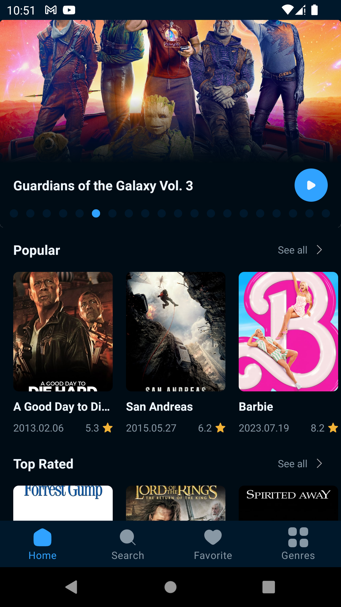  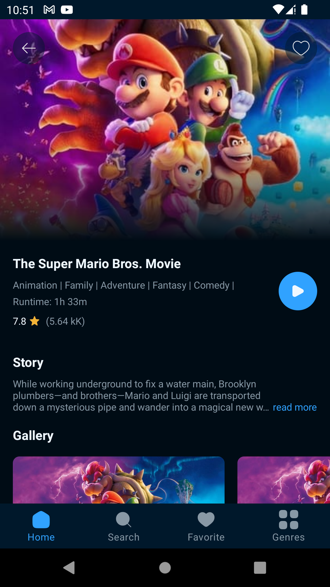  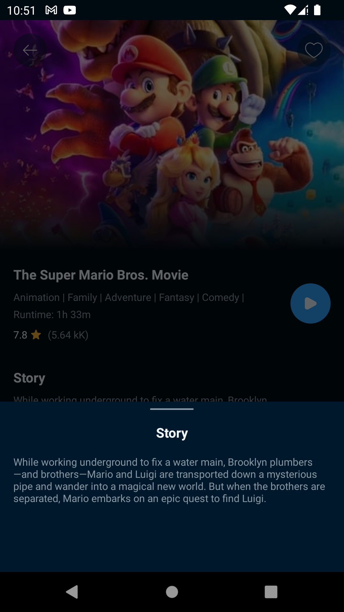

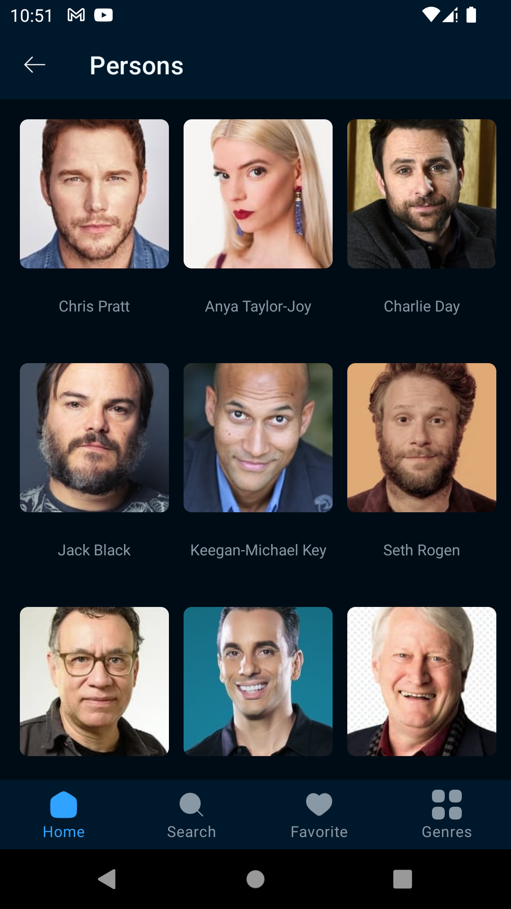  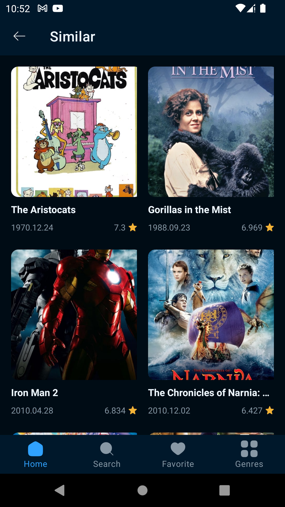  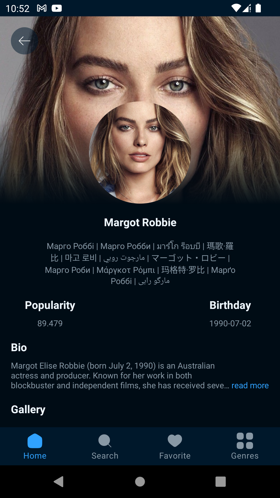 

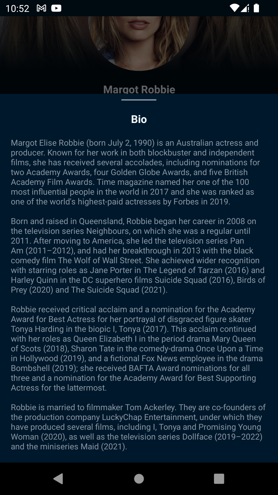  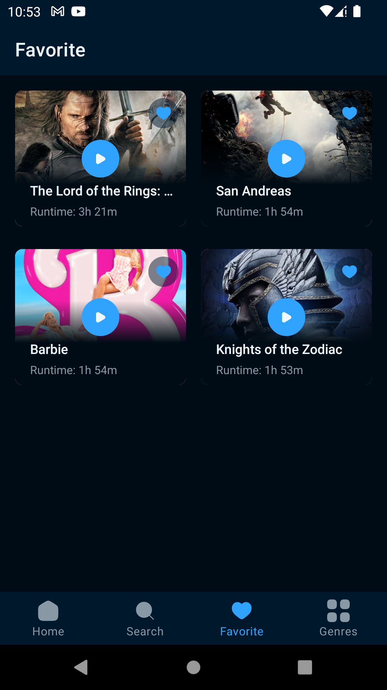  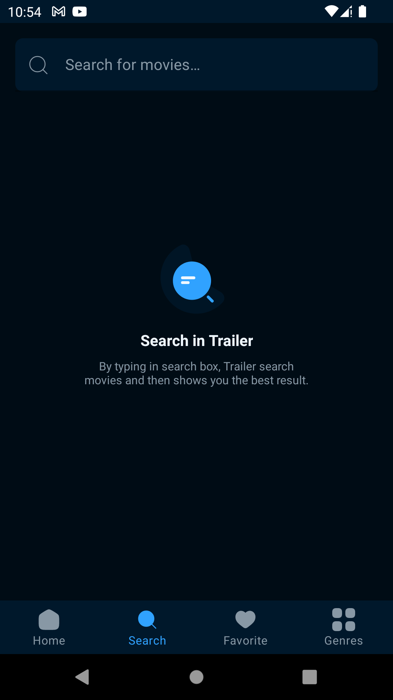

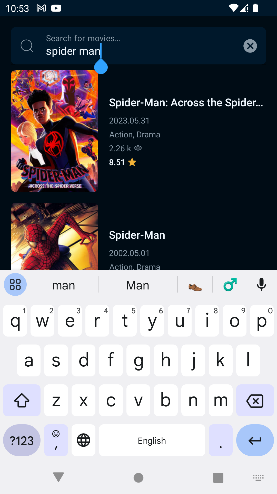  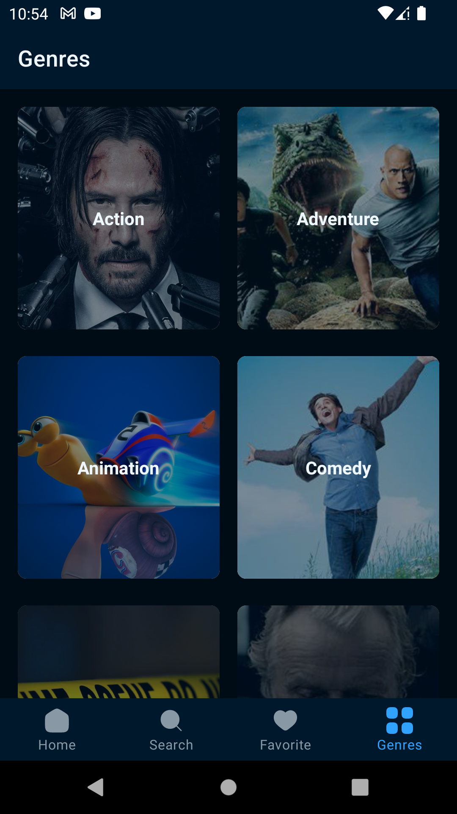


## ⚒️: Tech Stack.

1. [Kotlin](https://developer.android.com/kotlin)
2. [Retrofit](https://square.github.io/retrofit/)
3. [Dagger Hilt](https://developer.android.com/training/dependency-injection/hilt-android)
4. [Logging Interceptor](https://github.com/square/okhttp/blob/master/okhttp-logging-interceptor/README.md)
5. [Coroutines](https://developer.android.com/kotlin/coroutine)
6. [Kotlin Flow](https://developer.android.com/kotlin/flow)
7. [Room Database](https://developer.android.com/training/data-storage/room)
8. [Paging 3](https://developer.android.com/topic/libraries/architecture/paging/v3-migration)
9. [Shimmer](https://facebook.github.io/shimmer-android/)


## Prerequisites

Before running the app, ensure that you have the following:

- Android Studio (version 2022.2.1 or higher)
- Java Development Kit (JDK) (version 1.8 or higher)
- Trailer API key ([Sign up](https://www.themoviedb.org/documentation/api) for an account and obtain an API key)


## Getting Started

To get started with the Trailer Android app, follow these steps:

1. Clone this repository to your local machine using the following command:

```bash
git clone https://github.com/Bit-Camp-IO/TMDA-Android.git
```

2. Open Android Studio and select "Open an Existing Project."
3. Navigate to the cloned project directory and select it.
4. Android Studio will build and sync the project automatically.
5. Once the project is synced, navigate to the `app` directory in the project structure.
6. Open `local.properties` and add the following code, replacing `YOUR_API_KEY` with your Trailers API key:

```xml

apiKey =  YOUR_API_KEY  

```

7. Save the file.
8. Run the app on an emulator or physical device by clicking the "Run" button in Android Studio.


## Contributing

Contributions to the Trailers Android app are welcome! If you find any issues or want to add new features, please submit an issue or pull request on the GitHub repository.

When contributing, please adhere to the following guidelines:

- Fork the repository and create a new branch for your feature or bug fix.
- Ensure that your code follows the project's code style and conventions.
- Write clear and concise commit messages and provide a detailed description of your changes.
- Test your changes thoroughly before submitting a pull request.


## Support

If you found this repository helpful and learned even a little something from it, then consider supporting me by giving this repo a Star ⭐️
